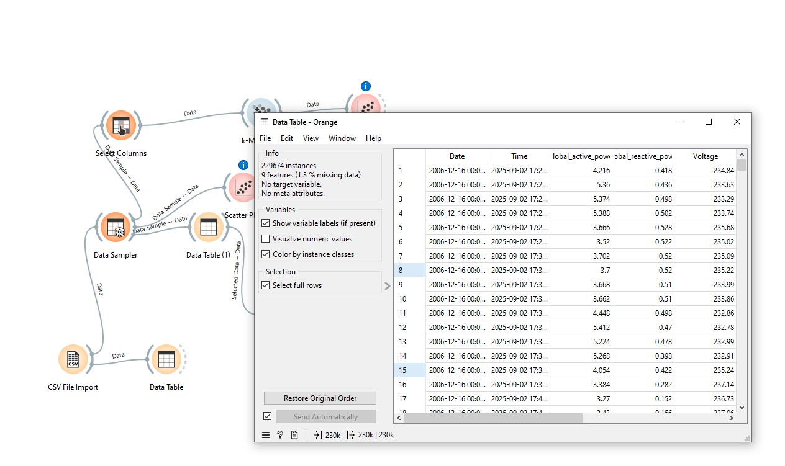
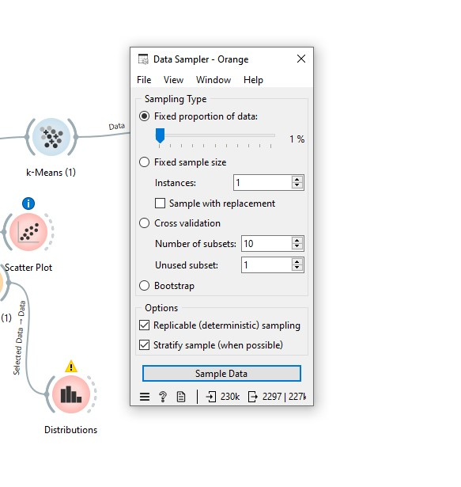
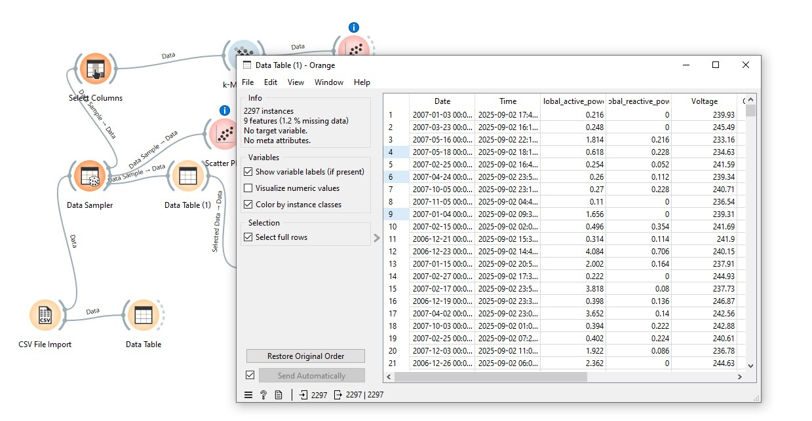
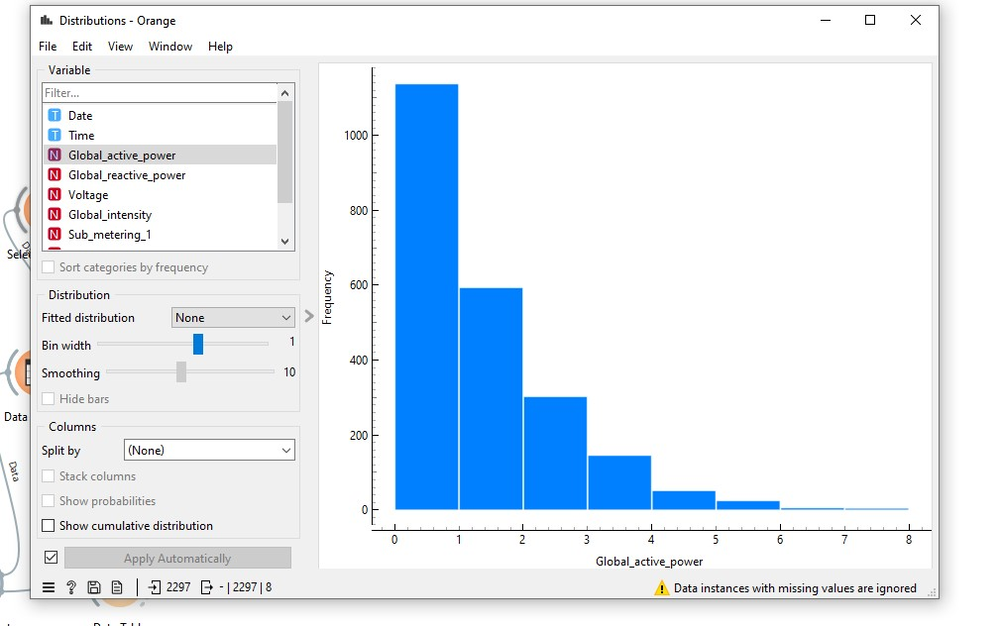
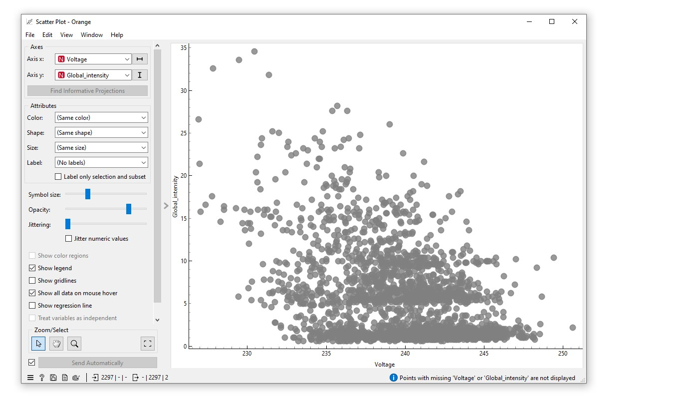
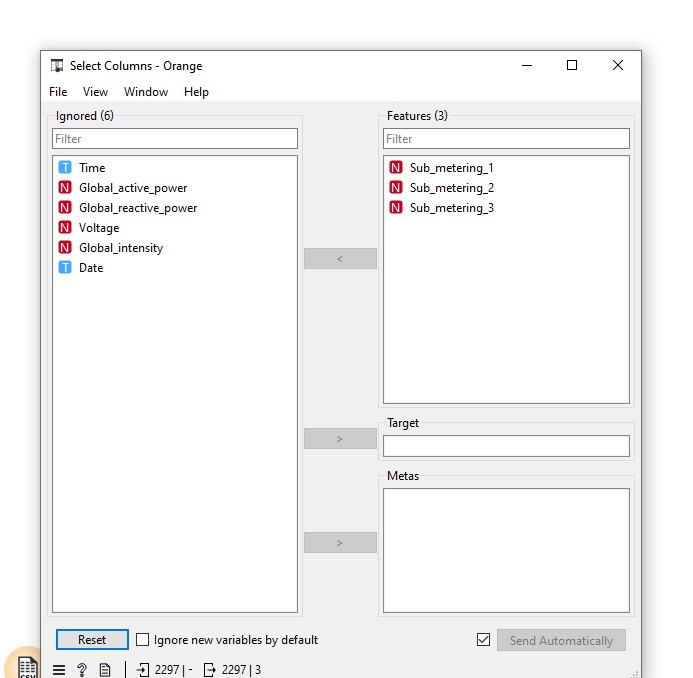
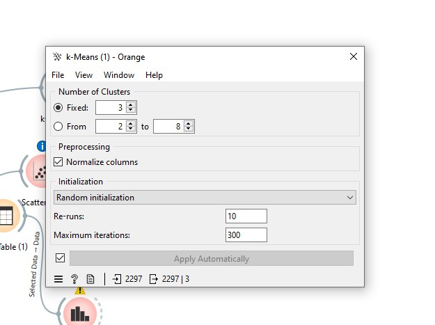
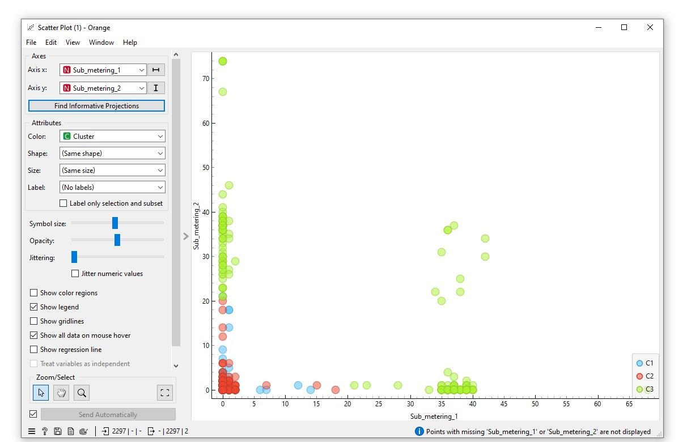

# cp4-ia

## 👥 Integrantes
### Caio Henrique - RM 554600
### Carlos Eduardo - RM 555223
### Antônio Lino - RM 554518

## 📊 Datasets Utilizados

### 1. Individual Household Electric Power Consumption
- **Fonte:** [UCI Machine Learning Repository](https://archive.ics.uci.edu/dataset/235/individual+household+electric+power+consumption)  
- **Descrição:** Medições de consumo elétrico em uma residência ao longo de quase 4 anos (2006–2010).  
- **Formato:** `household_power_consumption.txt` (aprox. 20 MB, separado por `;`)  
- **Número de observações:** 2.075.259 linhas  
- **Número de variáveis:** 9  

#### Variáveis principais:
- `Date` → Data (dd/mm/yyyy)  
- `Time` → Hora (hh:mm:ss)  
- `Global_active_power` → Potência ativa global (kW)  
- `Global_reactive_power` → Potência reativa global (kVar)  
- `Voltage` → Voltagem (V)  
- `Global_intensity` → Corrente global (A)  
- `Sub_metering_1` → Consumo da cozinha (Wh)  
- `Sub_metering_2` → Consumo da lavanderia (Wh)  
- `Sub_metering_3` → Consumo do aquecedor/ar-condicionado (Wh)  

---

### 2. Appliances Energy Prediction
- **Fonte:** [UCI Machine Learning Repository](https://archive.ics.uci.edu/dataset/374/appliances+energy+prediction)  
- **Descrição:** Dados de consumo de energia de eletrodomésticos junto com variáveis ambientais internas e externas (2016).  
- **Formato:** `energydata_complete.csv`  
- **Número de observações:** 19.735 linhas (cada linha = 10 minutos de leitura)  
- **Número de variáveis:** 29  

#### Variáveis principais:
- `Appliances` → Consumo de energia (Wh) dos eletrodomésticos  
- `lights` → Consumo de energia das luzes (Wh)  
- `T1...T9` → Temperaturas em diferentes áreas da casa (°C)  
- `RH_1...RH_9` → Umidades relativas em diferentes áreas da casa (%)  
- `T_out` e `RH_out` → Temperatura e umidade externas  
- `Windspeed` → Velocidade do vento (m/s)  
- `Visibility` → Visibilidade (km)  
- `Tdewpoint` → Temperatura do ponto de orvalho (°C)  

---

# 🍊 Exercícios 36-40: Orange Data Mining

## Exercício 36: Importação e Visualização Inicial
Objetivo: Carregar o dataset e visualizar as primeiras linhas.

Workflow utilizado:

CSV File Import → Data Table

Resposta: O dataset contém 9 variáveis e 229674 registros.

## Exercício 37: Amostragem de Dados (1%)
Objetivo: Criar uma amostra de 1% dos dados para análise mais rápida.

Resposta: A distribuição na amostra de 1% é semelhante à base completa devido à amostragem aleatória.

## Exercício 38: Distribuição do Consumo
Objetivo: Analisar a distribuição da variável Global_active_power.

Resposta: O consumo é concentrado em valores baixos (0-2 kW), com uma distribuição assimétrica positiva, indicando que a maioria do tempo o consumo é moderado, com poucos períodos de consumo muito alto.

## Exercício 39: Relação entre Variáveis Elétricas
Objetivo: Analisar a correlação entre Voltage e Global_intensity.

Resposta: Existe uma correlação negativa fraca a moderada entre Voltage e Global_intensity. Isso é fisicamente esperado, pois quando a voltagem diminui, a intensidade tende a aumentar para manter a mesma potência (P = V × I).

## Exercício 40: Clustering com K-Means
Objetivo: Segmentar os dados em 3 grupos usando as variáveis Sub_metering.

Variáveis utilizadas: Sub_metering_1, Sub_metering_2, Sub_metering_3

Número de clusters: 3

Algoritmo: k-Means

Resposta: Sim, cada cluster representa um padrão distinto de consumo doméstico:

Cluster C1 (Vermelho): Baixo consumo geral em todos os sub-medidores

Cluster C2 (Azul): Consumo moderado com padrões específicos

Cluster C3 (Verde): Alto consumo, especialmente em Sub_metering_1

Os clusters revelam diferentes perfis de uso doméstico, onde cada grupo representa comportamentos distintos de consumo elétrico nos diferentes circuitos da casa.
